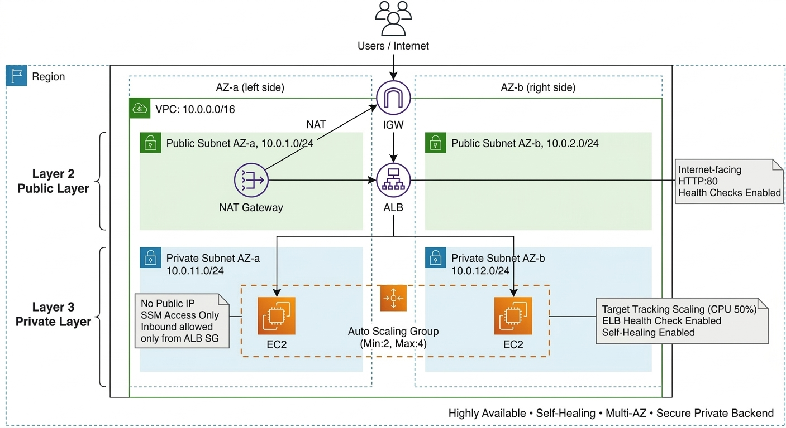
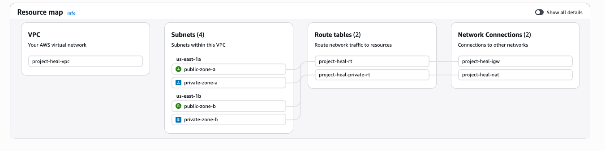
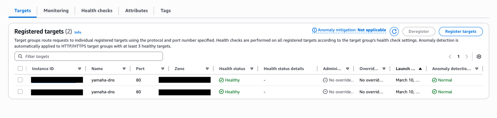
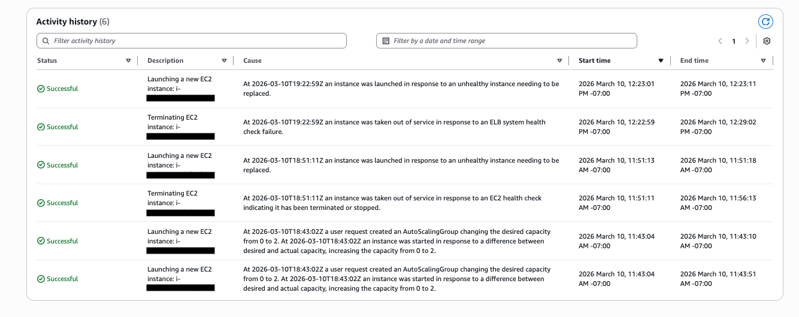
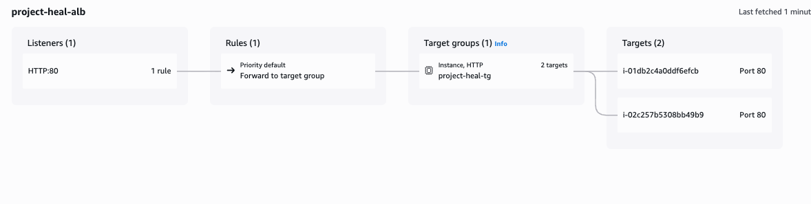

# 🚀 Highly Available & Resilient Infrastructure with Auto Scaling on AWS  
### Multi-AZ | Auto Scaling | Health-Based Recovery | Secure Private Backend

---

## 📌 Project Overview

Designed and deployed a **highly available, self-healing web infrastructure on AWS** that automatically detects and recovers from application and instance failures without manual intervention.

This project simulates real-world **Site Reliability Engineering (SRE)** principles by implementing:

- Multi-AZ high availability
- Health-based instance replacement
- Target tracking auto scaling
- Secure private subnet architecture
- Zero-SSH access using Systems Manager (SSM)
- Automated instance provisioning using Launch Templates

The system is built to **design for failure**, not just deployment.

---

## 📊 Architecture Diagram

---

## 🧱 Architecture Components

### 🌐 Networking Layer
- Custom VPC (10.0.0.0/16)
- 2 Public Subnets (Multi-AZ)
- 2 Private Subnets (Multi-AZ)
- Internet Gateway
- NAT Gateway (controlled outbound access)
- Separate Route Tables (public/private segmentation)

### ⚖️ Load Balancing Layer
- Application Load Balancer (ALB)
- Internet-facing
- HTTP (Port 80)
- Health checks enabled (`/` endpoint)

### 🖥️ Compute Layer
- Launch Template (immutable configuration)
- Auto Scaling Group (Min: 2, Max: 4)
- EC2 instances in private subnets only
- Amazon Linux 2
- Apache Web Server installed via User Data

### 🔐 Security Design
- No public IP on EC2 instances
- No SSH access (port 22 closed)
- SSM-only access using IAM role
- Security Group referencing:
  - ALB SG → EC2 SG only
- IAM role-based authentication (no static credentials)

### 📈 Scaling & Self-Healing
- Target Tracking Scaling Policy
- CPU utilization target: 50%
- ELB health checks enabled
- EC2 health checks enabled
- Automatic unhealthy instance termination and replacement
- SNS topic for mail notification

---

## 🔁 Self-Healing & Failure Testing

The system was intentionally stress-tested to validate resilience.

### 1️⃣ Application Crash Simulation
Stopped Apache service on one instance.

**Result:**
- ALB health check failed
- Target marked unhealthy
- ASG terminated instance
- New instance launched automatically
- System restored without downtime
- Email notification via SNS

---

### 2️⃣ Manual Instance Termination
Terminated one EC2 instance manually.

**Result:**
- ASG detected capacity drift
- Replacement instance launched immediately
- Desired capacity maintained (2 instances)
- Email notification via SNS

---

### 3️⃣ Load Spike Simulation
Generated high CPU load using stress tool.

**Result:**
- CPU utilization exceeded 50%
- ASG triggered scale-out event
- Additional instance launched
- System stabilized under load
- Email notification via SNS

---

## 🔍 Traffic Flow
Internet
➜
Internet Gateway
➜
Application Load Balancer (Public Subnets)
➜
Auto Scaling Group (Private Subnets across 2 AZs)
➜
NAT Gateway (Outbound only)

---

## 📊 Skills & Technologies Used

- Amazon EC2  
- Application Load Balancer (ALB)  
- Auto Scaling Groups  
- Launch Templates  
- Amazon VPC  
- NAT Gateway  
- IAM Roles  
- AWS Systems Manager (SSM)  
- CloudWatch Metrics  
- Linux (Amazon Linux 2)  

---
## 🏆 Production-Level Best Practices Implemented

✔ Private backend instances  
✔ No direct internet exposure  
✔ No SSH key management  
✔ Security group chaining  
✔ Health-based automation  
✔ Scaling based on metrics  
✔ Infrastructure resilience validation  

---

## 💡 Lessons Learned

- Health checks are critical for automated recovery.
- Multi-AZ deployment significantly improves fault tolerance.
- Proper security group segmentation prevents unintended exposure.
- Auto Scaling ensures infrastructure elasticity under dynamic workloads.
- Designing with failure scenarios in mind improves reliability.

---

## 📌 Why This Project Matters

This project demonstrates hands-on experience in:

- Building resilient cloud infrastructure
- Applying SRE principles
- Designing scalable production-ready systems
- Implementing automated recovery mechanisms
- Securing cloud-native applications

It reflects real-world DevOps and Site Reliability Engineering practices.

---

## 📈 Outputs

## 👤 Author

Jeevan Rohith Antony Manohar  
MS Computer Science | San Diego State University  
